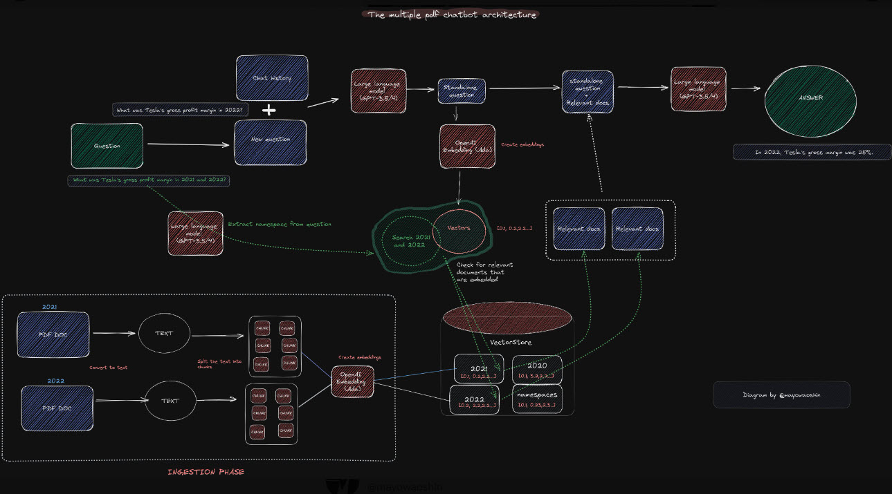

# Chat with Multiple PDFs

This project is a Streamlit application that allows users to interact with multiple PDF documents through a conversational interface powered by LangChain and OpenAI's GPT model. The app extracts text from uploaded PDFs, processes it into manageable chunks, and uses a FAISS vector store to enable efficient retrieval of information during the conversation.


## Features

- **PDF Text Extraction**: Upload multiple PDFs, and the app will extract the text content from each one.
- **Text Chunking**: The extracted text is divided into chunks for better processing and retrieval.
- **Vector Store**: FAISS vector store is used to encode and store text chunks for efficient similarity search.
- **Conversational Retrieval**: Engage in a conversation with the app, asking questions about the uploaded PDFs, and receive relevant information retrieved from the documents.
- **Memory**: The app maintains the conversation context, allowing for a more natural dialogue flow.

## Installation

To run this project locally, follow these steps:

1. **Clone the repository**:
    ```bash
    git clone https://github.com/yourusername/chat-with-multiple-pdfs.git
    cd chat-with-multiple-pdfs
    ```

2. **Create and activate a virtual environment**:
    ```bash
    python -m venv venv
    source venv/bin/activate  # On Windows use `venv\Scripts\activate`
    ```

3. **Install the required packages**:
    ```bash
    pip install -r requirements.txt
    ```

4. **Set up environment variables**:
    Create a `.env` file in the root directory and add your OpenAI API key:
    ```
    OPENAI_API_KEY=your_openai_api_key_here
    ```

5. **Run the Streamlit app**:
    ```bash
    streamlit run app.py
    ```

## Usage

1. **Upload PDFs**: Use the sidebar to upload one or more PDF documents.
2. **Process Documents**: Click the "Process" button to extract text and create the vector store.
3. **Ask Questions**: Type your questions about the uploaded documents in the text input field and interact with the app.

## Project Structure

## Technical Details

### PDF Text Extraction

The `get_pdf_text()` function leverages `PyPDF2` to extract text from each page of the uploaded PDFs.

### Text Chunking

The `get_text_chunks()` function uses the `CharacterTextSplitter` from LangChain to split the extracted text into chunks. This is essential for effective retrieval and ensuring the model can process the text efficiently.

### Vector Store

The `get_vectorstore()` function encodes the text chunks using the `SentenceTransformer` model ('all-MiniLM-L6-v2') and stores the embeddings in a FAISS vector store for fast retrieval.

### Conversational Retrieval Chain

The `get_conversation_chain()` function sets up a retrieval-based conversational model using OpenAI's GPT model. The conversation is stored in memory using `ConversationBufferMemory`, which allows the app to maintain the context of the conversation.

## LinkedIn

Connect with me on [LinkedIn](https://linkedin.com/in/anupvjpawar).

## License

This project is licensed under the MIT License. See the [LICENSE](LICENSE) file for details.
